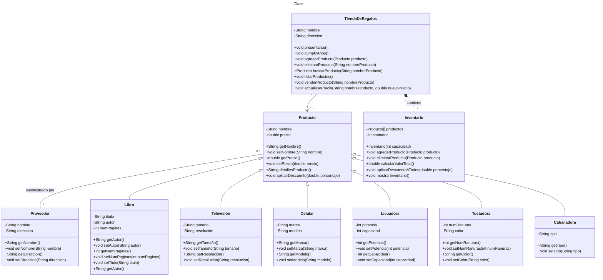

# Proyecto - Dando vida a los objetos de una tienda de regalos para la gestión de inventarios

## Objetivo General:
Introducirte de manera práctica en los conceptos fundamentales de la programación orientada a objetos (POO).
Al realizar esta práctica, podrás:
- Comprender la idea de clase y objeto: Aprenderás a modelar entidades del mundo real ( como Televisión) clases en un programa y a crear instancias de esas clases (objetos).
- Dominar atributos y métodos: Entenderás cómo definir las características (atributos) y comportamientos (métodos) de un objeto.
- Practicar encapsulación: Aprenderás a proteger los datos internos de una clase y a proporcionar acceso controlado a ellos a través de métodos.
- Aplicar conceptos básicos de POO: Refuerzarás tus conocimientos sobre conceptos como constructor, getters y setters.
- Aplicar conceptos de relaciones entre clases
- Aplicar conceptos de herencia y reutilización de métodos
- Desarrollar habilidades de resolución de problemas: Pondrás en práctica tu capacidad para analizar un problema, diseñar una solución y traducirla a código.
## Objetivos Específicos:
Modelar un concepto del mundo real: 
- Aprenderás a representar una entidad tangible (Libro, Televisión) como una clase en un lenguaje de programación como Java
- Implementar atributos y métodos: Definirás las características de una Libro (titulo, auto, etc.) como atributos y las acciones que puede realizar (comprar, vender) como métodos.
- Utilizar encapsulación: Protegerás los datos internos de la clase (atributos) y controlarás el acceso a ellos a través de métodos públicos (getters y setters).
- Crear objetos: Instanciarás múltiples objetos de la clase Libro, cada uno representando a una libro diferente.
- Interactuar con objetos: Utilizarás los métodos definidos para modificar y obtener información de los objetos.
- Comprender el ciclo de vida de un objeto: Observar cómo se crean, modifican y destruyen los objetos durante la ejecución del programa.
- Crear relaciones entre clases (asociación, agregación, composición y generalización)
- Comprender la sobreescritura de métodos heredados
- Escribir código limpio y legible: Utilizar buenas prácticas de programación como nombres descriptivos para variables y métodos, comentarios explicativos, y una estructura de código organizada.

## Arquitectura de Tres Capas

Este proyecto sigue una arquitectura de tres capas para asegurar una separación clara de responsabilidades y mejorar la mantenibilidad del código. Las tres capas son:

### 1. Capa de Presentación (UI)
La capa de presentación es responsable de interactuar con el usuario. Esta capa contiene las clases que manejan la interfaz de usuario y la lógica de presentación.

- **Paquete**: `presentacion`
- **Responsabilidades**:
  - Capturar la entrada del usuario.
  - Mostrar la salida al usuario.
  - Interactuar con la capa de negocio para realizar operaciones.

### 2. Capa de Negocio (Business Logic)
La capa de negocio contiene la lógica de negocio de la aplicación. Esta capa actúa como intermediario entre la capa de presentación y la capa de datos.

- **Paquete**: `negocio`
- **Responsabilidades**:
  - Implementar la lógica de negocio.
  - Validar y procesar los datos.
  - Coordinar las operaciones entre la capa de presentación y la capa de datos.

### 3. Capa de Datos (Data Access) //PENDIENTE DE DESARROLLAR
La capa de datos es responsable de la persistencia y recuperación de datos. Esta capa contiene las clases que representan las entidades de datos y las clases de acceso a datos (DAO).

- **Paquete**: `datos`
- **Responsabilidades**:
  - Manejar la persistencia de datos.
  - Proporcionar métodos para acceder y manipular los datos almacenados.


## Introducción:

El objetivo principal de esta práctica es familiarizarte con los conceptos fundamentales de la programación orientada a objetos (POO) a través de la creación de un conjunto de clases para una tienda de regalos a clase. 
Al finalizar esta práctica, deberás ser capaz de:
- Modelar entidades del mundo real como objetos de software.
- Definir atributos y métodos para caracterizar a un objeto.
- Utilizar los principios de encapsulación para proteger los datos internos de un objeto.
- Crear e instanciar objetos de una clase.
- Interactuar con los objetos mediante sus métodos.
## Desarrollo de la Práctica:

1. Definir la clase Libro, Televisión, Celular, Licuadora, Tostadora, Calculadora: 
 Identificar los atributos relevantes 
 Crear métodos para acceder y modificar estos atributos (getters y setters).
 Implementar métodos que representen acciones que una Tienda de Regalos puede realizar (presentarse, cumplir años, etc.).
2. Crear objetos: 
   o instanciar varios objetos de la clase Libro, Televisión, Celular, Tostadora y Calculadora con diferentes valores para sus atributos.
3. Interactuar con los objetos: 
   o Utilizar los métodos definidos para realizar acciones con los objetos creados.
4. Definir la clase Producto y estudiar la relación con las clase creadas en el punto 1
5. Definir las relaciones entre las clases como herencia(Producto-> Libro, Calculadora, etc.), 
   agregación(TiendaRegalos->Producto), asociación(Producto->Provedor) y composición(inventario->Producto)

## Entregables:

  - El código fuente de las clases en un repositorio
  - Un diagrama de clases UML con la representación de las clases y sus relaciones
  - Un programa principal que demuestre el uso de la clase.
  - Una explicación de las decisiones de diseño tomadas.

## * En la segunda para del ejercicio:*
- Crear una clase Inventario que gestione un arreglo de productos y permita realizaroperaciones comunes como agregar productos, calcular el valor total del inventario y aplicar descuentos a todos los productos.

- **Clase Producto**: Define propiedades y métodos comunes para todos los productos, como nombre, precio, aplicarDescuento, y detallesProducto.

- **Clase Inventario**: Gestiona un arreglo de productos y permite agregar productos, calcular el valor total del inventario, aplicar descuentos a todos los productos y mostrar el inventario.

- **Constructor**: Inicializa el arreglo de productos con una capacidad fija.

- **Método agregarProducto**: Agrega un producto al arreglo si hay espacio disponible.

- **Método calcularValorTotal**: Calcula el valor total del inventario sumando los precios de todos los productos.

- **Método aplicarDescuentoATodos**: Aplica un descuento a todos los productos en el inventario.

- **Método mostrarInventario**: Muestra los detalles de todos los productos en el inventario.

- **Clase Main**: Crea instancias de diferentes productos, los agrega al inventario, aplica descuentos y muestra el inventario antes y después de aplicar los descuentos, así como el valor total del inventario.


## Diagrama de clases
[Editor en línea](https://mermaid.live/)

[Referencia-Mermaid](https://mermaid.js.org/syntax/classDiagram.html)

## Diagrama de clases UML con draw.io
El repositorio está configurado para crear Diagramas de clases UML con ```draw.io```. Para usarlo simplemente agrega un archivo con extensión ```.drawio.png```, das doble clic sobre el mismo y se activará el editor ```draw.io``` incrustado en ```VSCode``` para edición. Asegúrate de agregar las formas UML en el menú de formas del lado izquierdo (opción ```+Más formas```).

## Clase TiendaDeRegalos:

Atributos: nombre, dirección
Métodos: presentarse, cumplirAños
Clase Producto (clase base para los productos):

Atributos: nombre, precio
Métodos: getters y setters para los atributos
Clases derivadas de Producto:

Libro: atributos adicionales como autor, número de páginas
Televisión: atributos adicionales como tamaño, resolución
Celular: atributos adicionales como marca, modelo
Licuadora: atributos adicionales como potencia, capacidad
Tostadora: atributos adicionales como número de ranuras, color
Calculadora: atributos adicionales como tipo (científica, básica)
Relaciones:

La clase TiendaDeRegalos tiene una relación de agregación con la clase Producto (puede tener múltiples productos).

La clase Libro, Televisión, Celular, Licuadora, Tostadora, Calculadora tiene una relación de herencia con Producto

## Uso del proyecto con make

### Default - Compilar+Probar+Ejecutar
```
make
```
### Compilar
```
make compile
```
### Probar todo
```
make test
```
### Ejecutar App
```
make run
```
### Limpiar binarios
```
make clean
```
## Comandos Git-Cambios y envío a Autograding

### Por cada cambio importante que haga, actualice su historia usando los comandos:
```
git add .
git commit -m "Descripción del cambio"
```
### Envíe sus actualizaciones a GitHub para Autograding con el comando:
```
git push origin main
```
## Comandos individuales
### Compilar

```
find ./ -type f -name "*.java" > compfiles.txt
javac -d build -cp lib/junit-platform-console-standalone-1.5.2.jar @compfiles.txt
```
Ejecutar ambos comandos en 1 sólo paso:

```
find ./ -type f -name "*.java" > compfiles.txt ; javac -d build -cp lib/junit-platform-console-standalone-1.5.2.jar @compfiles.txt
```


### Ejecutar Todas la pruebas locales de 1 Test Case

```
java -jar lib/junit-platform-console-standalone-1.5.2.jar -class-path build --select-class miTest.AppTest
```
### Ejecutar 1 prueba local de 1 Test Case

```
java -jar lib/junit-platform-console-standalone-1.5.2.jar -class-path build --select-method miTest.AppTest#appHasAGreeting
```
### Ejecutar App
```
java -cp build miPrincipal.Principal
```
Los comandos anteriores están considerados para un ambiente Linux. [Referencia.](https://www.baeldung.com/junit-run-from-command-line)
